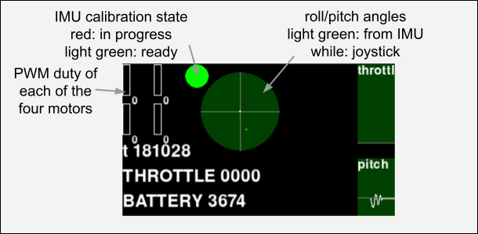

# ginhibari-quadcopter
An indoor quadcopter project using ESP32 microprocessors

# Firmware

## Required Libraries
- [Arduino's Madgwick library](https://github.com/arduino-libraries/MadgwickAHRS)
- Arduino libraries for the platform (M5Stack ATOM)
- (TODO: check if there is any other required libraries)

## Build

Firmware is built for different platforms sharing some source code.

- firmware/matrix --- The original hardware using M5AtomMatrix
- firmware/atomfly --- AtomFly (version 1) by M5Stack
  - Battery monitoring is unavailable for this platform because the board does not have such electronic circuit. As a placeholder, the code always return 2048 as a fake A/D converter result, which indicates approximately 3.7V.

Open the subfolder with Arduino IDE, so that it can compile and upload to the device.

Alternatively, Makefiles are placed in each directory to be used with arduino-cli. `make upload` builds and uploads the firmware (serial port should be /dev/ttyUSB0)

## Wireless LAN Configuration

Currently, only the client mode is supported. (i.e. you need to set up a Wireless LAN access point, and make the robot connect to it.)

1. Connect to the robot to your PC using a USB cable.
1. Open a serial terminal. (e.g. /dev/ttyUSB0 115200)
1. Press the reset button of the device.
1. Hit any key while it is attempting to connect to a Wi-Fi AP.
1. Confirm the prompt `SSID=` is shown. Input the SSID and then enter.
1. Confirm the prompt `password=` is shown. Input the AP password and then enter.
1. It should say "Saved.".
1. After successfully connecting to the AP, it shows "Connected" and then the IP address of the device.

If it does not connect indefinitely, make sure the SSID/password are correct. Retry from step 2 or 3.

```
Connecting to WiFi AP []...
....interrupted
SSID=my_SSID
password=my_password
Saved.
Connecting to WiFi AP [my_SSID]...
.....Connected
IP Address:192.168.1.123
UDP Listening on IP: 192.168.1.123
```

Note that a backspace key is not processed properly when entering strings. Please reset and retry from the beginning instead.

# Host-side Scripts

## Motor Test

Spins the four motors one by one for a moment.

Connect bettery to the robot.

```
 $ scripts/motor_test.py 192.168.1.123
```

## Gamepad Console

A program for flying the robot by manual control using a gamepad. It also provides visualization for IMU and other status.

Connect a DualShock3 game controller to the PC via USB.

```
 $ scripts/joystick.py ini/atomfly.ini 192.168.1.123
```

Make sure to put focus on the window, or the key/joystick input is not recognized.

### Key Assignment
- [ESC] to exit.
- [a][d][w][x] to adjust roll/pitch trim. (The trim is not persisted. Write to .ini file manually if needed.)
- Left stick (axis #1) for throttle. 0% when neutral and 100% when fully up.
- Right stick (#3, #4) for roll and pitch control.

Joystick axis IDs are hard-coded in joystick.py (around lines 51--56) assuming the default configuration with Dualshock3 and Ubuntu. They may be different with different USB game controllers or operating systems.

### IMU / Gyroscope Calibration
IMU Calibration is needed before flight.

For those devices which use MPU6886 (`matrix/` and `atomfly/`), this process reads the values of 3 gyros for a few seconds continuously and estimates the origin (the value which corresponds to 0 [degrees/second]) of the sensors. Gyroscope origin may drift slightly for a while (like approx. 10 or 30 seconds) after turning the power on. In such case you may need to retry until it stabilizes, before taking off.

Calibration is started when starting the script or adjusting a trim, and takes about 3 seconds until it finishes. Do not move the robot while the calibration status signal is red.

1. Power on the robot, and put it on the floor stably.
1. Start the program.
1. See the calibration state signal (see the screenshot) is red and then it turns green after a few seconds.
1. Check "yaw" graph and see if it is flat. If it is, the robot is ready to fly.
1. Otherwise, type [a] [d] (adjust roll trim +1 and then -1) to trigger the calibration again. Go back to step 3.

### Display



# Third-party Code

The C++ source code files under `firmware/atomfly/third_party/m5stack/` are imported from [M5Stack's ATOM Library](https://github.com/m5stack/M5Atom/tree/master/). The license noted in the LICENSE file in the subdirectory is applied to the files there.
- https://github.com/m5stack/M5Atom/tree/master/examples/ATOM_BASE/ATOM_FLY
